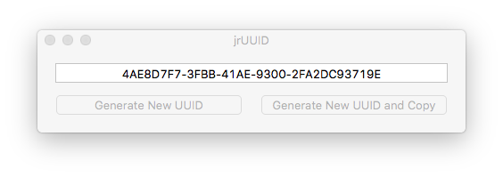

Any AkashaCMS project requires two configuration files:

* `package.json` contains Node.js dependencies, a `scripts` section for command strings, and various bits of metadata like a project home page or source code repository
* The _Configuration_ object, usually in a file named `config.js`, describing the project to AkashaCMS

AkashaEPUB projects have another configuration file:

* The publishing metadata that's contained a YAML file typically called `book.yml`.

The primary purpose of this file is documenting the data destined to go into the OPF and NCX files.  Those files are the EPUB metadata files, containing the book title, authors, identifying strings (ISBN etc), the reading order of the files, and more.  Rather than generate those files yourself, this file simplifies your life and _epubtools_ takes care of the details.

In this chapter we'll go over all three.


# AkashaRender Configuration file and `package.json`

The configuration of any AkashaRender/AkashaCMS project is split between the Configuration file and the `package.json`.  The latter is used by `npm` and the Node.js platform to list package `dependencies`, the available `scripts` for performing actions related to the project, and various metadata items like project owner identification or the projects home page.  For an AkashaEPUB project, the `scripts` section can be used to describe the build process, while the `dependencies` will list the EPUB-related AkashaCMS plugins.

The Configuration file, typically named `config.js`, is a Node.js module that produces an AkashaRender _Configuration_ object.  While the Configuration object can be created any way you like, it's most straightforward to use a `config.js` file.  There's nothing special about that file name, and it can be named anything you like.  In fact the project can have multiple Configuration files for different purposes.

More details about AkashaRender project configuration are at: https://akashacms.com/akasharender/configuration.html

Here's a couple `config.js` files for EPUB's:

* This book:  https://github.com/akashacms/epub-guide/blob/master/config.js
* The EPUB Skeleton: https://github.com/akashacms/epub-skeleton/blob/master/config.js


```
'use strict';

const akasha  = require('akasharender');

const config = new akasha.Configuration();

config
    .addAssetsDir('assets')
    .addLayoutsDir('layouts')
    .addDocumentsDir('documents')
    .addPartialsDir('partials');

config
    .use(require('akasharender-epub'))
    .use(require('akashacms-footnotes'));

config.addStylesheet({ href: "/css/style.css" });

config.setMahabhutaConfig({
    recognizeSelfClosing: true,
    recognizeCDATA: true,
    xmlMode: true
});

config.prepare();

module.exports = config;
```

This is a fairly simple configuration file.  They can grow to be rather complex depending on your needs.  We pull in the `akasharender` module, then instantiate a Configuration object, call some methods, and assign the object to `module.exports`.  The last step makes the Configuration object available to AkashaRender.

The first set of methods, `addAssetsDir` and the others, inform AkashaRender what directories to use for certain purposes.  For more on this see [](5-structure.html)

The second set informs AkashaRender the AkashaCMS plugins to use with the `use` method.  The `use` call is given the Plugin object resulting from `require("plugin-name")`, describing the plugin to AkashaRender.  Used this way, there must be a corresponding entry in `package.json` for each Plugin so that `npm` can easily download the dependencies required to build the book.

An AkashaCMS plugin will modify AkashaRender's execution to add new capabilities.  Typically a plugin will add a Partials directory, and add new custom DOM processing and custom tag functions using the Mahabhuta DOM-processing engine.  The two plugins listed here are especially useful for EPUB's, namely:

* `akasharender-epub` contains various cleanup's required because of EPUB3 limitations.
* `akashacms-footnotes` provides a simple way to generate a list of footnotes at the bottom of the page.

With `addStylesheet` we declare a CSS file to use in every page.  

When the `<link id="stylesheet" href="/css/style.css" type="text/css"/>` tag is generated, AkashaEPUB will automatically rewrite the `href` attribute to the correct relative URL.

With `setMahabhutaConfig` we describe the HTML rendering output.  We have to specify `xmlMode: true` because EPUB3 requires XHTML files.

Likely package dependency entries in `package.json`:

```
"dependencies": {
    ...
    "akashacms-footnotes": ">=0.6",
    "akasharender-epub": "akashacms/akasharender-epub",
    "mahabhuta": ">=0.6.3",
    "akasharender": ">=0.6",
    "epubtools": ">=0.3",
    "globfs": "*"
    ...
}
```

# Publishing metadata - `book.yaml`

The third configuration file is used by _epubtools_ and contains the metadata required for the XML files (OPF and NCX) that are tucked inside the EPUB.  What _epubtools_ does is to automatically generate those XML files for you from data it gathers from the content files and from this metadata file.

This `book.yaml` is from the EPUB Skeleton project https://github.com/akashacms/epub-skeleton/blob/master/book.yml

```
opf: skeleton.opf
epub: skeleton.epub

title: Skeletal AkashaEPUB book
languages: [ en ]
identifiers:
    - unique: true
      uuid: "b624d2ee-e88a-11e4-b0db-376a7655914b"
published:
    date: "2017-07-06T22:15:14Z"
creators:
    - id: author
      name: John Smith
      nameReversed: Smith, John
publisher: AkashaCMS.COM
subjects: [ "Reference" ]
rights: "Public Domain"

cover:
    writeHtml: { id: "cover", href: "cover.html" }
    idImage: "cover-image"
    src:  "images/Human-Skeleton.jpg"
    alt:  "AkashaEPUB Skeleton Book"
    type: "image/jpeg"

toc: { id: "toc", href: "toc.html" }
ncx: { id: "ncx", href: "toc.ncx"  }
```


The entries should be fairly self-explanatory.  We'll go over these in more detail in the following sections.


## What is YAML?

The YAML format is a powerful-but-simple text format for encoding richly structured data.  Think of it as JSON or XML without all the curly braces or angle brackets.  We'll quickly go over the YAML format and in later sections go over specific data items.  The YAML page on Wikipedia ([https://en.wikipedia.org/wiki/YAML](https://en.wikipedia.org/wiki/YAML)) is the best documentation I've found on YAML.

An object is declared using a `name: value` structure.  For string objects the quotation marks are optional.

An array of items is declared using square brackets: `name: [ value1, value2, value3 ]`

An object with named elements is declared with subsidiary `name: value` items.  There are several ways to write such objects:

```
name:
    id: "someId"
    title: The Title String

name: { id: "someId", title: "The Title String" }
```

Generally YAML does the right thing with converting the text content of a tag into a string.  Sometimes you need to use special characters in tag content that will confuse YAML.  For example:

```
name:
    title: The Good, the Bad and The Ugly: a Retrospective
```

That `:` character will cause YAML to become confused.  In such a case it's necessary to put quotes around the text:

```
name:
    title: "The Good, the Bad and The Ugly: a Retrospective"
```

A similar issue is that if YAML see's a string of numbers, it assumes the field value to be numerical.  If instead the field value is, say, a product ID where leading 0's are important, it's necessary to throw quote's around the field value so that YAML treats it as a string rather than a number.

Finally, a list of items is declared using a `-` character to denote the beginning of each item:

```
name:
    - item1
    - item2

list:
    - { id: "id1", title: "The Title String" }
    - { id: "id2", title: "Another Title String" }
```


## EPUB Metadata files


The metadata you enscribe in your book project is used to generate various metadata files and packaging every required file into the EPUB file.  EPUB files are just ZIP files with a `.epub` extension, containing certain files as described in the EPUB3 specification.  

The types of files AkashaEPUB can currently generate are:

* `mimetype` - simple text file containing the required MIME type of the EPUB book.
* `OPF` - The Open Package Format file which indexes every file in the EPUB container, as well as metadata about the book.  OPF is new to EPUB3, and supplants the NCX file.
* `NCX` - The older package index file which, while it has been deprecated by EPUB3, is still useful because many EPUB readers still look in this file for the Table of Contents.
* `HTML Navigation Document` - An HTML page containing the Table of Contents, with navigation markup specified in EPUB3.
* `META-INF/container.xml` - Informs the EPUB software where to find the `ebook.opf`

The EPUB3 specification supports some additional files.  At this time AkashaEPUB does not generate those files.

## Names of generated files

Let's now look at the first segment of the `book.yml` configuration.

There are two files where you, the author of your EPUB, need to tell AkashaEPUB the file names to use:


```
opf: skeleton.opf
epub: skeleton.epub
```

The `opf` member controls the file name for the OPF file.  That file name is squirted into `META-INF/container.xml` so that EPUB readers know where to find the file.  

The `epub` member controls the file name of the generated EPUB file.

If you don't specify these, the following will be used:

```
opf: "ebook.opf"
epub: "ebook.epub"
```

## Generating an NCX file

The NCX file is optional.  While the EPUB3 specification says not to use NCX files, many EPUB readers still look for this file.  Some of us will find it useful to generate an NCX file into the EPUB.

The NCX file carries both metadata and a content index, organized to convey the chapter/sub-chapter structure.

To cause AkashacmsEPUB to generate the NCX file, add the following to the `book.yml` file:

```
toc: { id: "toc", href: "toc.html" }
ncx: { id: "ncx", href: "toc.ncx"  }
```

We'll discuss Table of Contents generation in more detail in a future chapter - [](5-structure.html).  

If the `ncx` member is present, the NCX file is generated.  It's name within the EPUB will be the value of the `href` field.


## Title & Languages

The `title` member, of course, holds the Book Title.

The `languages` member specifies which language (or languages) in which the book is written.  Books can, and sometimes are, written in multiple languages, so simply list what's appropriate.  The language codes are taken from RFC5646 ([www.ietf.org/rfc/rfc5646.txt](http://www.ietf.org/rfc/rfc5646.txt)]) and might look like this for a book written in both English and French.

```
title: Skeletal AkashaEPUB book
languages: [ en, fr ]
```

## Identifiers

While the ISBN is the primary system for identifying books, it's not the only game in town.  For many important uses one doesn't even need an ISBN depending on how the book is being distributed.

Generally speaking an __identifier__ is a unique (hopefully) text string assigned to a specific book.  While that's seemingly simple, it's a little tricky in practice.  Book identifiers play different roles in different scenarios.

The ISBN is a product identifier.  The publisher doesn't have to acquire a new ISBN for minor revisions, but it is required to do so for a completely new edition.  The publisher also must acquire an ISBN for each format the book is published in.  In other words, the product identifier is how book distributors and stores distinguish one physical book from another.  The key word is _physical_ because ISBN's purpose is primarily controlling inventory of printed books in warehouses and bookstores.  It's widely thought eBook do not require an ISBN, but of course you should check with an authoritative source on this.

The product identifier is useful for book distributors, but it doesn't tell us whether two versions of an electronic book are bit-for-bit identical.  

The EPUB3 committee settled on two identifiers that together satisfy both the need for a product identifier, and a bit-for-bit identicalness identifier.  Over the next few paragraphs we'll go over how to represent this in AkashaEPUB.

Consider:

```
identifiers:
    - unique: true
      uuid: "b624d2ee-e88a-11e4-b0db-376a7655914b"
```

The `identifiers` list contains product identifiers.  An EPUB can have multiple identifiers, hence we support more than one.  However, only one of them can be the unique identifier for the EPUB.  The `unique` attribute is required on one and only one of these identifiers.  It can have any value you wish, it just needs to be present.  

The supported identifier formats are:

* `uuid` or Unique Universal ID.  The format is simply a UUID string.
* `urn` or Universal Resource Notation.  There are many other URN formats to use.

The example shows use of a UUID.  Under the covers it is converted to the correct format in the OPF file.  Generating a UUID string is fairly easy and there are many available applications that correctly generate a UUID.  

<figure>

<figcaption>The jrUUID application for Mac OS X</figcaption>
</figure>

Several open source tools to generate UUID's are in the npm registry.  Simply follow these steps:

```
$ npm install uuid --save
epub-guide@0.6.1 /Users/david/akasharender/epub-guide
└── uuid@3.1.0
$ ./node_modules/.bin/uuid
f1e90602-9f7c-4f52-a8a5-6de10ea0988e
```

The UID printed by the tool can be inserted into `book.yml` as so:

```
identifiers:
    - unique: true
      uuid: "D4C91B0C-33C0-4E00-810A-E4C2D8CD4BAE"
```


By specifying `urn` you can use any URN (uniform resource name - [en.wikipedia.org/wiki/Uniform_resource_name](https://en.wikipedia.org/wiki/Uniform_resource_name)) as an identifier.  URN's are similar in purpose and format to a URL.  Instead of specifying an address of a page on the Web a URN more generally gives a unique name to a "resource", like a book.  The Wikipedia page has some good examples.  The URN prefix tells us what kind of resource name it is, in this case an ISBN.  For our purposes in building EPUB's there are approximately three URN formats of interest:

* DOI: `urn:doi:....` -- Digital Object Identifier
* ISBN: `urn:isbn:123456789X` -- This is the standard identifier string for books, the international standard book number
* UUID: `urn:uuid:6e8bc430-9c3a-11d9-9669-0800200c9a66` -- This is just a string of self-assigned numbers that you guarantee is a unique universal identifying number.

The ISBN number system is controlled by the International ISBN Agency ([www.isbn-international.org/](https://www.isbn-international.org/)), through regional ISBN agencies.  Publishers or authors can acquire ISBN numbers through the agency for their country or region.  Some say that ISBN's are unnecessary for electronic books, and indeed none of the e-book marketplaces require an ISBN.  If you've acquired an ISBN for your book, use it in the method shown above.

If you must generate an NCX file, and if your NCX file has to carry a different identifier than the OPF file, do this:

```
identifiers:
    - unique: true
      urn: " .... one identifier"
      ncxidentifier: " ... another identifier"
```

If you do this, the epubcheck program (see [](6b-validation.html)) will give you a WARNING that the OPF and NCX identifiers should be equal.

So far we've talked about the publication identifier, and promised to discuss a second identifier that's used for bit-for-bit identicalness.  Now's the time to do so.

The method chosen by the EPUB3 committee was to use the `date` metadata value.  By gluing together the publishing identifier just discussed, and the publishing date, an EPUB reader can tell one EPUB from another.  One simply must be sure to generate a new publishing date each time the EPUB is generated.

The EPUB's publishing date is specified as so

```
date: "2015-02-21T00:00:00Z"
```

The date string most conform to the W3C date format, as shown here.  This `date` attribute fills in the `dc:date` element in the OPF metadata.  Another date field, the `dcterms:modified` element, is automatically generated by AkashaEPUB to indicate the exact time the EPUB was built.  If you do not provide a `date`, it is generated for you.

## Creators and Contributors

The `creators` member lists all the authors (creators) of the document.  

```
creators:
    - id: author
      name: John Smith
      nameReversed: Smith, John
```

List one per "creator".  The `name` and `nameReversed` field takes care of different ways the name is presented in different systems.  Additional fields can be given to refine the data.   You can also list `contributors` whose role was less significant.

```
contributors:
    - id: contrib1
      name: "John Smith"
      nameReversed: "Smith, John"
```

## Other metadata

The `publisher` member gives the name of the publisher.  This is simply the proper name for the publisher.

The `subjects` member gives an array of keyphrases or keywords describing the topic or topics covered in the book.

The `rights` member is a statement of intellectual property rights held over the document.  For example: "Copyright 2015, David Herron".

The `source` member is used when an EPUB was derived from another source publication, such as a print version of a book.  Use the Identifier of that other publication.
