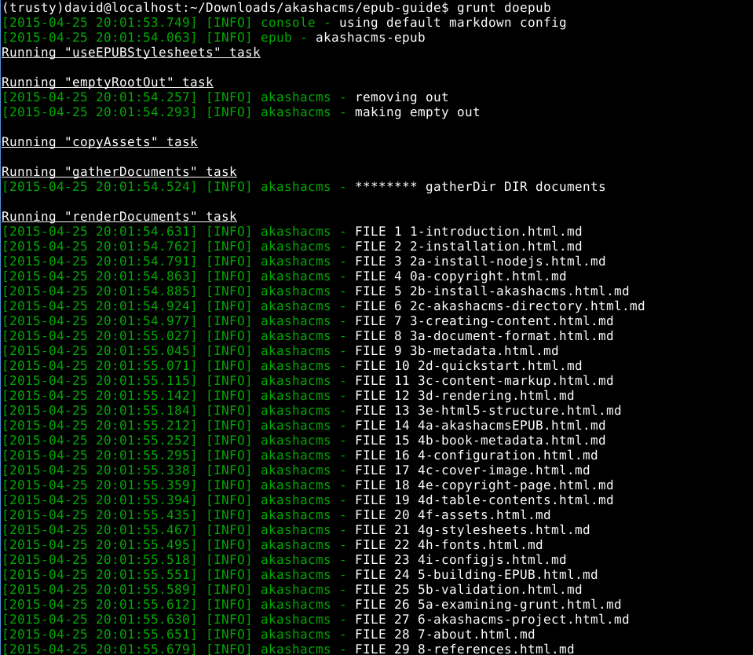

To understand how to use Grunt to build an EPUB with AkashaEPUB, we'll step our way through the epub-skeleton Gruntfile.

The first step is to initialize AkashaCMS and AkashaEPUB.  Because this isn't being run through the `akashacms` command-line tool, the Gruntfile has to do what the `akashacms` command does to initialize AkashaCMS.  The following code snippet is it.  A side effect of the `akasha.config` line is to call the `config` function in `config.js` which in turn causes the `akashacms-epub` plugin to hook itself into AkashaCMS.  

```
    var akasha = require('akashacms');
    var config = require('./config.js');
    akasha.config(config);
```

This code snippet makes the `akasha` plugin object, and the site `config` object, available to Grunt tasks.

```
    module.exports = function(grunt) {
        ...
        grunt.initConfig({
            akasha: akasha,
            config: config
        });
        ...
    };
```

In the Grunt task code, these values are retrieved as so.  

```
    grunt.config.requires('akasha');
    grunt.config.requires('config');
    var akasha = grunt.config('akasha');
    var config = grunt.config('config');
```

Getting back to the Gruntfile, we register AkashaCMS and AkashaEPUB tasks with Grunt:

```
    grunt.loadNpmTasks('akashacms');
    grunt.loadNpmTasks('akashacms-epub');
```

The next step patches the stylesheet configuration to work for generating EPUB's.  During the AkashaCMS config step, it added stylesheets to the `headerScripts` object that are for websites.  We cannot use those stylesheets in an EPUB.  To replace the AkashaCMS stylesheets with ones useful for EPUB, use this in-line task.  It resets the configuration to use the stylesheets declared in `config.js` in the `akashacmsEPUB` object.

```
    grunt.registerTask('useEPUBStylesheets', function() {
        config.headerScripts.stylesheets
            = config.akashacmsEPUB.stylesheets;
    });
```

We now have enough pieces declared to show the build process itself.

```
    grunt.registerTask("doepub", [
        'useEPUBStylesheets', 'emptyRootOut',
        'copyAssets', 'gatherDocuments',
        'renderDocuments', 'generateEPUBFiles',
        'bundleEPUB'
    ] );
```

When we typed `grunt doepub` back in <a href="2-installation.html"></a>, this is the process which ran.

It might look like this on your screen



The tasks are:

* `useEPUBStylesheets` As we just discussed, this substitutes EPUB-centric CSS files.
* `emptyRootOut` Deletes the existing `root_out` directory, and creates an empty one.
* `copyAssets` Copies files from all the `root_assets` directories.
* `gatherDocuments` Scans the `root_docs` directories for document files.
* `renderDocuments` Renders all the documents into `root_out`.
* `generateEPUBFiles` Provided by `akashacms-epub`, this generates all the EPUB packaging files.
* `bundleEPUB` Provided by `akashacms-epub`, this builds the .EPUB file.

The `renderDocuments` task is where the rendering process ([](3-creating-content.html)) is performed.

The `generateEPUBFiles` task is where the book structure is generated ([](4-configuration.html)).

The tasks can be run individually if desired.

```
    $ grunt emptyRootOut copyAssets
```

This would just set up the `root_out` directory with asset files, and do nothing else.  The build could then be done:

```
    $ grunt useEPUBStylesheets gatherDocuments renderDocuments generateEPUBFiles
```

And finally build the EPUB as a separate task

```
    $ grunt bundleEPUB
```

## Modifying the Gruntfile

Because the workflow is implemented in the Gruntfile, you can make it anything you want.  AkashaEPUB is an open system that lets you freely design your EPUB construction workflow.  As said earlier, you can use the Gruntfile's we provide and get on with the task of writing your book.  Or your book may require specific steps such as downloading data from somewhere to massage it into your book.  It's completely up to you how you make use of AkashaEPUB.

It may be useful to minify the HTML and CSS files before bundling the EPUB file.  The `grunt-contrib-htmlmin` and `grunt-contrib-cssmin` plugins are excellent for that purpose.

Maybe your workflow requires uploading the completed EPUB to a staging server.  The `grunt-sftp-deploy` plugin is a very useful tool to do so.

The build process for the akashacms.com website ([github.com/akashacms/akashacms-website/blob/master/Gruntfile.js](https://github.com/akashacms/akashacms-website/blob/master/Gruntfile.js)) shows how to integrate all three of those tools.


